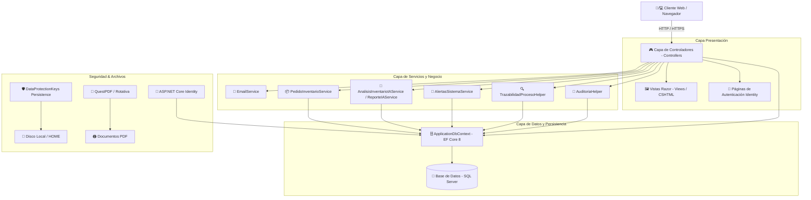

# ☕ Sistema de Gestión Agroindustrial - Microbeneficio San Gabriel

[](https://dotnet.microsoft.com/)
[](https://docs.microsoft.com/ef/)
[](https://www.microsoft.com/sql-server/)
[](#-integrantes-del-proyecto---grupo-n-3)

Bienvenido a la documentación oficial del sistema de información para el **Microbeneficio San Gabriel**. Esta aplicación web agroindustrial permite la trazabilidad completa, control operativo, gestión financiera y comercialización del café de especialidad, integrando procesamiento de lotes, control de inventarios, pedidos, facturación y reportes analíticos asistidos.

---

## 👥 Integrantes del Proyecto - Grupo N° 3

* **Grupo:** N° 3
* **Proyecto:** Sistema de Gestión y Trazabilidad Agroindustrial para Microbeneficio San Gabriel
* **Integrantes del Grupo:**

  1. **Ignacio Cascante Navarro**
  2. **Franco Cortes Trejos**
  3. **Nelson Rodriguez Lopez**
  4. **Kevin Vargas Morales**

---

## 🏗️ Arquitectura del Sistema

El proyecto está desarrollado bajo el patrón de arquitectura **Model-View-Controller (MVC)** en **.NET 8**, promoviendo un diseño limpio, desacoplado y mantenible.



### Principios Arquitectónicos y Componentes Clave:
* **Separación de Responsabilidades (SoC):** Desacoplamiento estricto entre presentación (MVC Razor), capa de aplicación/servicios y acceso a datos (EF Core).
* **Persistencia Robusta de Claves (Data Protection):** Almacenamiento seguro de tokens y claves de sesión en disco (`DataProtectionKeys`), garantizando estabilidad durante reinicios de servidor o publicaciones en la nube.
* **Seguridad Defensiva Integrada:** Cabeceras HTTP de seguridad (`X-Frame-Options`, `X-Content-Type-Options`, `Referrer-Policy`, `Permissions-Policy`), protección contra falsificación de solicitudes (Antiforgery tokens) y cookies estrictas (`HttpOnly`, `SameSite`, `SecurePolicy`).
* **Soporte de Model Binding Flexible:** Implementación de `FlexibleDecimalModelBinderProvider` para garantizar compatibilidad con formatos numéricos regionales (admite `,` y `.`).
* **Internacionalización de Errores de Identity:** Personalización en español para mensajes de error de autenticación mediante `SpanishIdentityErrorDescriber`.

---

## 🧱 Módulos del Sistema

| Módulo | Descripción | Controladores / Vistas |
| :--- | :--- | :--- |
| 🌾 **Productores y Fincas** | Registro de caficultores, ubicación geográfica, variedades cultivadas, certificación y altitude de cosecha. | `ProductoresController`, `FincasController` |
| ☕ **Lotes y Procesamiento** | Control de ingreso de café cereza/húmedo, tipo de beneficio (Lavado, Natural, Honey, Anaeróbico), mermas y procesos (despulpado, fermentado, secado, trillado, tostado). | `LotesController`, `ProduccionesController` |
| 🔍 **Trazabilidad de Procesos** | Cadena de custodia del grano desde la recepción de la finca hasta el empaque final comercializable. | `TrazabilidadesController`, `TrazabilidadProcesoHelper` |
| 📦 **Inventario y Productos** | Catálogo de presentaciones de café (grano, molido, especialidades), movimientos de entradas/salidas, stocks mínimos y máximos. | `ProductosController`, `MovimientosInventarioController` |
| 🛒 **Ventas y Pedidos** | Carrito de compras, procesamiento de pedidos en línea, compras asistidas y ciclo de vida del pedido (Pendiente, Procesado, Enviado, Entregado). | `PedidosController`, `PedidoInventarioService` |
| 🧾 **Facturación y Finanzas** | Emisión de comprobantes de pago, cálculo de impuestos (IVA 13%), descarga de facturas en PDF y control de ingresos/egresos del negocio. | `FacturasController`, `RegistrosFinancierosController`, `FacturaDocument` |
| 📊 **Reportes e Inteligencia** | Paneles ejecutivos con métricas de rendimiento, informes de ventas, rentabilidad y diagnósticos asistidos por IA. | `ReportesController`, `AnalisisInventarioIAService`, `ReporteIAService` |
| 🔔 **Notificaciones y Alertas** | Avisos en tiempo real para usuarios según stock bajo, lotes pendientes o cambios de estado en pedidos. | `NotificacionesController`, `AlertasSistemaService` |
| 🔐 **Usuarios y Auditoría** | Gestión de cuentas, asignación de roles y registro inmutable de auditoría de cada acción relevante en el sistema. | `UsuariosController`, `AuditoriasController`, `AuditoriaHelper` |

---

## 🛠️ Servicios Integrados

El sistema cuenta con una arquitectura de servicios inyectados por **Inyección de Dependencias (DI)**:

1. **`EmailService` (`IEmailService`):**
   * Envío de correos transaccionales en HTML formateado vía SMTP.
   * Notificaciones automáticas para verificación de cuenta, restablecimiento de contraseña, confirmación de pedidos y avisos administrativos.
   * Incluye script de configuración rápida mediante User Secrets (`ConfigurarCorreoGmail.ps1`).

2. **`PedidoInventarioService` (`IPedidoInventarioService`):**
   * Lógica transaccional para reservar, deducir o restituir productos del inventario al procesar, modificar o cancelar un pedido.
   * Previene inconsistencias de stock por concurrencia.

3. **`AnalisisInventarioIAService` (`IAnalisisInventarioIAService`) & `ReporteIAService` (`IReporteIAService`):**
   * Servicios de diagnóstico avanzado y proyecciones de disponibilidad de grano.
   * Análisis de tendencias de consumo para alertar al operador sobre lotes necesarios para tueste.

4. **`AlertasSistemaService` (`IAlertasSistemaService`):**
   * Motor de reglas preventivas que genera alertas cuando el stock cae por debajo del nivel mínimo o se detectan demoras en etapas de secado/tostado.

5. **`AuditoriaHelper`:**
   * Registro transparente de cambios (Creación, Modificación, Eliminación) indicando el usuario, fecha/hora, dirección IP y valores previos/posteriores.

6. **Generador de Facturas PDF (`FacturaDocument` / QuestPDF & Rotativa):**
   * Motor de maquetación y exportación de documentos PDF con formato profesional para comprobantes de venta y reportes.

---

## 🔐 Roles de Usuario y Matriz de Permisos

El sistema implementa **ASP.NET Core Identity** habilitando 4 roles principales con permisos diferenciados:

```
                          ┌──────────────────────────┐
                          │    🎭 ROLES DEL SISTEMA   │
                          └─────────────┬────────────┘
                                        │
      ┌─────────────────┬───────────────┴───────────────┬─────────────────┐
      ▼                 ▼                               ▼                 ▼
👑 Administrador   ⚙️ Operador                      💼 Vendedor       🛍️ Cliente
 (Acceso Total)  (Procesamiento/Inventarios)       (Ventas/Facturas)  (Catálogo/Pedidos)
```

### Matriz de Permisos por Rol:

| Funcionalidad / Módulo | 👑 Administrador | ⚙️ Operador | 💼 Vendedor | 🛍️ Cliente |
| :--- | :---: | :---: | :---: | :---: |
| **Gestión de Usuarios y Roles** | ✅ | ❌ | ❌ | ❌ |
| **Bitácora de Auditoría** | ✅ | ❌ | ❌ | ❌ |
| **Configuración General del Sistema** | ✅ | ❌ | ❌ | ❌ |
| **Registro de Fincas y Productores** | ✅ | ✅ | ❌ | ❌ |
| **Recepción y Procesamiento de Lotes** | ✅ | ✅ | ❌ | ❌ |
| **Movimientos de Inventario de Café** | ✅ | ✅ | ❌ | ❌ |
| **Consulta de Trazabilidad de Lotes** | ✅ | ✅ | ✅ | ✅ (Sólo sus compras) |
| **Gestión de Ventas y Facturación** | ✅ | ❌ | ✅ | ❌ |
| **Creación de Pedidos Asistidos** | ✅ | ❌ | ✅ | ❌ |
| **Catálogo y Compra Online** | ✅ | ❌ | ❌ | ✅ |
| **Historial de Mis Pedidos** | ✅ | ❌ | ❌ | ✅ |
| **Visualización de Reportes e IA** | ✅ | ✅ | ✅ | ❌ |

---

## 💻 Tecnologías Utilizadas

* **Framework Principal:** .NET 8.0 (C# 12) - ASP.NET Core MVC & Razor Pages
* **ORM & Base de Datos:** Entity Framework Core 8.0 / Microsoft SQL Server
* **Autenticación y Seguridad:** ASP.NET Core Identity, Microsoft.AspNetCore.DataProtection
* **Generación de Reportes / PDF:** QuestPDF (Community License), Rotativa.AspNetCore
* **Diseño e Interfaz de Usuario:** HTML5, CSS3 Vanilla / Custom Design Tokens, JavaScript, Bootstrap / FontAwesome, Toastr / SweetAlert
* **Enviador de Correos:** System.Net.Mail con SMTP SSL (Gmail Integration)

---

## 🚀 Guía de Instalación y Configuración Local

### Prerrequisitos
1. **.NET 8.0 SDK** o superior ([Descargar aquí](https://dotnet.microsoft.com/download/dotnet/8.0))
2. **Microsoft SQL Server** (LocalDB, SQLEXPRESS o instancia completa)
3. **Visual Studio 2022** (con carga de trabajo de desarrollo ASP.NET) o **Visual Studio Code**

### Pasos de Configuración

1. **Clonar o descargar el repositorio:**
   ```bash
   git clone <URL_DEL_REPOSITORIO>
   cd MicrobeneficioSanGabriel
   ```

2. **Configurar la Cadena de Conexión:**
   Revisar o ajustar el archivo `appsettings.json` o `appsettings.Development.json`:
   ```json
   "ConnectionStrings": {
     "DefaultConnection": "Server=localhost\\SQLEXPRESS;Database=MicrobeneficioSanGabriel;Trusted_Connection=True;TrustServerCertificate=True;"
   }
   ```

3. **Ejecutar Migraciones e Inicializador de Base de Datos:**
   Al iniciar la aplicación, las migraciones se aplican automáticamente gracias a `DatabaseCompatibilityHelper.EnsureLatestSchemaAsync`.
   Si deseas aplicarlas manualmente vía CLI:
   ```bash
   dotnet ef database update
   ```

4. **(Opcional) Configurar Credenciales SMTP para Correo Real:**
   Ejecutar el script interactivo en PowerShell o utilizar `dotnet user-secrets`:
   ```powershell
   .\ConfigurarCorreoGmail.ps1
   ```

5. **Ejecutar la Aplicación:**
   ```bash
   dotnet run
   ```
   Abrir un navegador e ingresar a `https://localhost:7025` (o el puerto asignado).

---

## 📌 Sembrado de Datos e Inicios de Sesión (Seeding)

El sistema incluye una clase de inicialización (`DbInitializer`) que al arrancar crea automáticamente los **4 roles del sistema** (`Administrador`, `Operador`, `Vendedor`, `Cliente`).

Para configurar las credenciales del usuario Administrador inicial, puedes establecer las variables en User Secrets o variables de entorno:
```bash
dotnet user-secrets set "AdminSeed:Email" "admin@sangabriel.com"
dotnet user-secrets set "AdminSeed:Password" "Admin123!"
dotnet user-secrets set "AdminSeed:Nombre" "Administrador"
dotnet user-secrets set "AdminSeed:Apellidos" "General"
```

---

## 📄 Licencia y Derechos

Desarrollado como proyecto académico para el curso de Desarrollo Web / Ingeniería de Software por los integrantes del **Grupo N° 3**. Todos los derechos reservados © 2026 - Microbeneficio San Gabriel.
